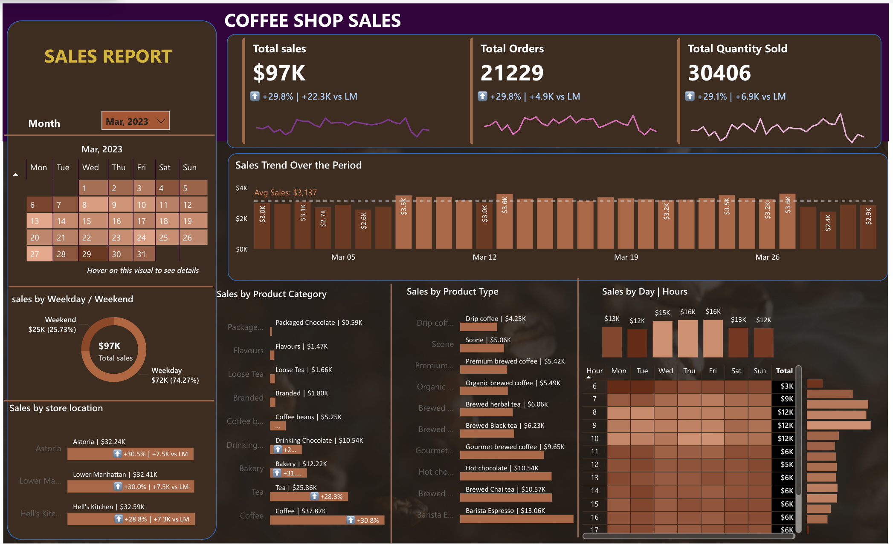

# Coffee Shop Sales Performance Analysis



## Overview

This project analyzes daily transaction patterns, product performance, and revenue drivers for a multi-location coffee shop. It uses data transformation and Power BI visualization to identify peak hours, compare store performance, and support recommendations for inventory and promotional strategies.

## Project Structure

- `README.md` — project documentation
- `.gitignore` — repository ignore rules
- `data/` — raw sales dataset
  - `Coffee Shop Sales.csv`
- `assests/` — project assets and preview images
  - `dashboard.png`
- `report/` — interactive Power BI report files
  - `coffee shop Sales Report.pbix`
- `docs/` — supporting documentation
  - `data_dictionary.md`

> Note: The repository currently uses the folder name `assests/`.

## Key Findings

- Analyzed over 149,000 individual transactions across multiple stores.
- Identified morning rush hours and peak operational times.
- Compared performance across three store locations:
  - Lower Manhattan
  - Hell's Kitchen
  - Astoria
- Tracked product profitability for categories such as Coffee, Tea, and Bakery.

## Dataset

The dataset contains point-of-sale transaction records with pricing, product, and timing details. For column definitions and methodology, see `docs/data_dictionary.md`.

## Power BI Report

The interactive dashboard includes:

- Total gross revenue and transaction volume trends
- Sales patterns by hour of day and day of week
- Product category performance and average order value (AOV)
- Location-based sales comparisons

## How to View

### Option A — Power BI Service (Web/Mac)

1. Go to `app.powerbi.com` and sign in.
2. Navigate to your workspace.
3. Upload the `.pbix` file from the `report/` folder.

### Option B — Power BI Desktop (Windows)

1. Open Power BI Desktop.
2. Open `report/coffee shop Sales Report.pbix`.

## Getting Started

### Prerequisites

- Power BI account or Power BI Desktop installation
- Git for cloning the repository

### Setup

```bash
git clone https://github.com/your-username/Coffee_shop_sales.git
cd Coffee_shop_sales
```

If you use Git LFS for large files:

```bash
git lfs install
git lfs track "*.pbix"
```

## Tools & Technologies

- Power BI — dashboards, visualization, and data modeling
- Data modeling and analytics from CSV data
- Git / GitHub — version control and repository management

## License

This project is intended for educational and portfolio use.

## Author

Preeti Lata
